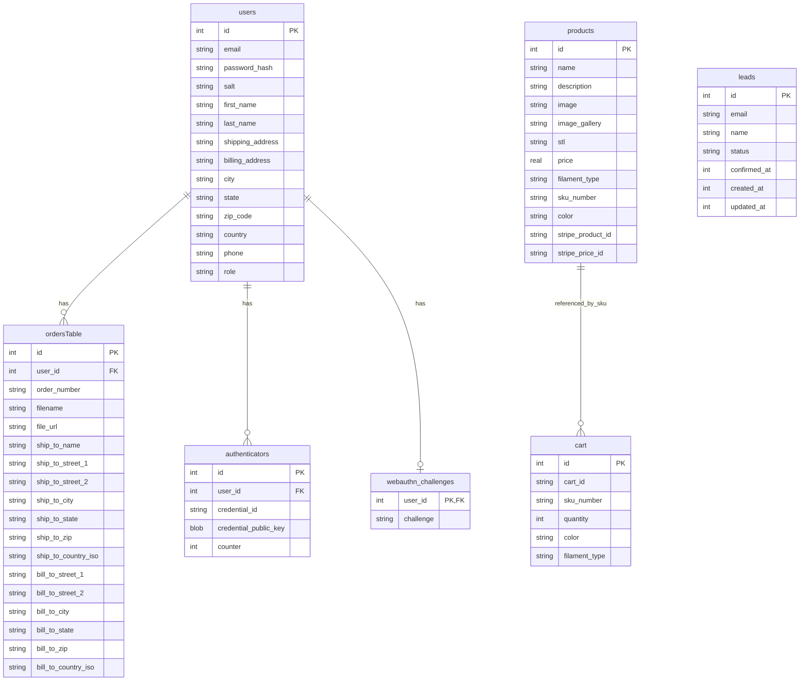

db information:

```mermaid
erDiagram
  users {
    int id PK
    string email
    string password_hash
    string salt
    string first_name
    string last_name
    string shipping_address
    string billing_address
    string city
    string state
    string zip_code
    string country
    string phone
    string role
  }
  ordersTable {
    int id PK
    int user_id FK
    string order_number
    string filename
    string file_url
    string ship_to_name
    string ship_to_street_1
    string ship_to_street_2
    string ship_to_city
    string ship_to_state
    string ship_to_zip
    string ship_to_country_iso
    string bill_to_street_1
    string bill_to_street_2
    string bill_to_city
    string bill_to_state
    string bill_to_zip
    string bill_to_country_iso
  }

  authenticators {
    int id PK
    int user_id FK
    string credential_id
    blob credential_public_key
    int counter
  }

  webauthn_challenges {
    int user_id PK, FK
    string challenge
  }

  products {
    int id PK
    string name
    string description
    string image
    string image_gallery
    string stl
    real price
    string filament_type
    string sku_number
    string color
    string stripe_product_id
    string stripe_price_id
  }

  cart {
    int id PK
    string cart_id
    string sku_number
    int quantity
    string color
    string filament_type
  }

  leads {
    int id PK
    string email
    string name
    string status
    int confirmed_at
    int created_at
    int updated_at
  }

  users ||--o{ ordersTable : has
  users ||--o{ authenticators : has
  users ||--o| webauthn_challenges : has
  products ||--o{ cart : referenced_by_sku
```
